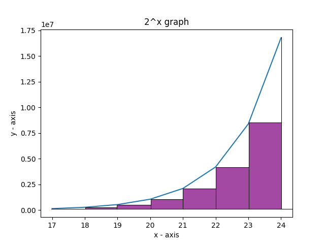

### Hello everyone! 

Today we are going to look into an interesting limit which can be found in the very well known book "Analyse - Recueil d’exercices et aide-mémoire" written by Jacques Douchet (2.39) :

$\displaystyle \lim_{n \to \infty} (\frac{1}{n} \sum_{k = 0}^{n} 2^{\frac{k}{n}})$

At a first glance this limit can seem very intimidating and surely there is a good reason for that. As one might expect there are multiple ways of solving this problem. The reader is invited to try solving it and coming up with a solution :).

The solution proposed in this article is at least to some extent unique or even weird as we are going to make good  use of the integral. But how? Let's dive into it together!

Let's recall the definition of the Riemann Integral. Let $[a, b]$ a closed interval on the axis of real numbers. A partition of $[a, b]$ is a finite sequence:

$a=x_{0}\le\xi_{1}\le x_{1}...x_{n-1} \le\xi_{n}\le x_{n}=b$.
This divides the initial interval into n subintervals $[x_{i-1}, x_i]$. We choose a point $\xi_i$ between each $x_{i-1}$ and $x_{i}$ and let $\Delta_i$ the distance between  $\xi_i$ between $x_{i-1}$ and $x_{i}$. Therefore we can write the Riemann Sum of a function $f$ defined on the interval $[a, b]$ as:

$\displaystyle \sum_{i = 1}^{n} f(\xi_i)\Delta_i$

We also denote the $mesh$ as the maximum $\Delta_i$.
Now, the final part: we can say that the Riemann Integral is equal to $S$ if for all $\epsilon > 0 $ there exists $\delta >0$ such that for any partition of $[a,b]$ with the 

$ mesh < \delta $ 

and 
$ |S - \displaystyle \sum_{i = 1}^{n} f(\xi_i)\Delta_i| < \epsilon $.

Now that we got the "formal" definition out of the way, let's develop a more intuitive approach while also getting back to our example. Let's forget for now about the $\frac{1}{n}$ part and look just at $2^{\frac{k}{n}}$. Below we have a plot of the function $2^x$.

{: width="400" height="400" }

Let's try to approximate the area under the curve using rectangles.Let's suppose we want to make our approximation better and better by constructing more and more rectangles. We all know that this is the main idea behind the integral. Let's get back to our initial limit.

$\displaystyle \lim_{n \to \infty} (\frac{1}{n} \sum_{k = 0}^{n} 2^{\frac{k}{n}})$

But wait a minute! Isn't it the same thing as before? Yes it is. Basically the limit describes a lot of rectangles which approximate the area under the $2^x$ curve. $\frac{1}{n}$ is the width of the rectangle while $2^{\frac{k}{n}}$ is the height of the rectangle.

In other words, the final result of the limit is the following integral:

$\left(\int_{0}^{1} 2^x \; dx\right)$.

Note that we integrate from 0 to 1 because of the $\frac{1}{n}$ part. This is not exactly the same thing as the graph presented above, but kept for educational purposes.

Solving it we obtain:
$\left. \frac{2^x}{ln2} \right|_{0}^{1} = \frac{2}{ln2} - \frac{1}{ln2} = \frac{1}{ln2}$.

Therefore

$\displaystyle \lim_{n \to \infty} (\frac{1}{n} \sum_{k = 0}^{n} 2^{\frac{k}{n}}) = \frac{1}{ln2}$.

